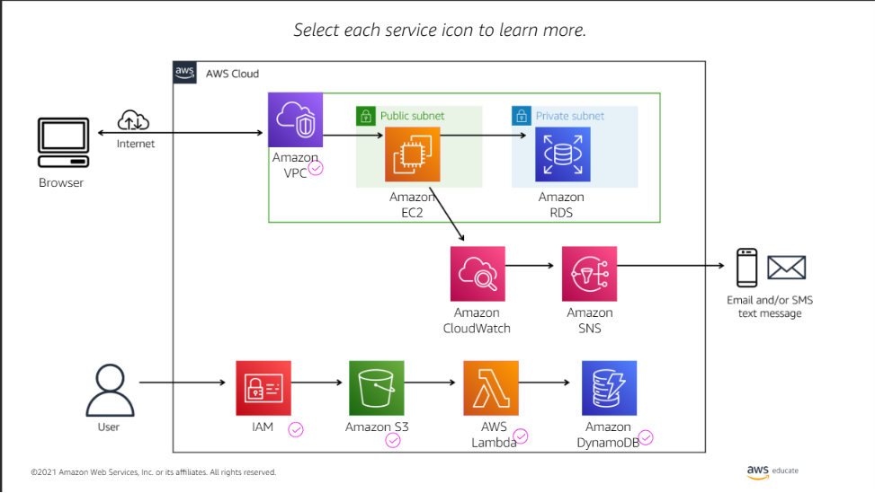
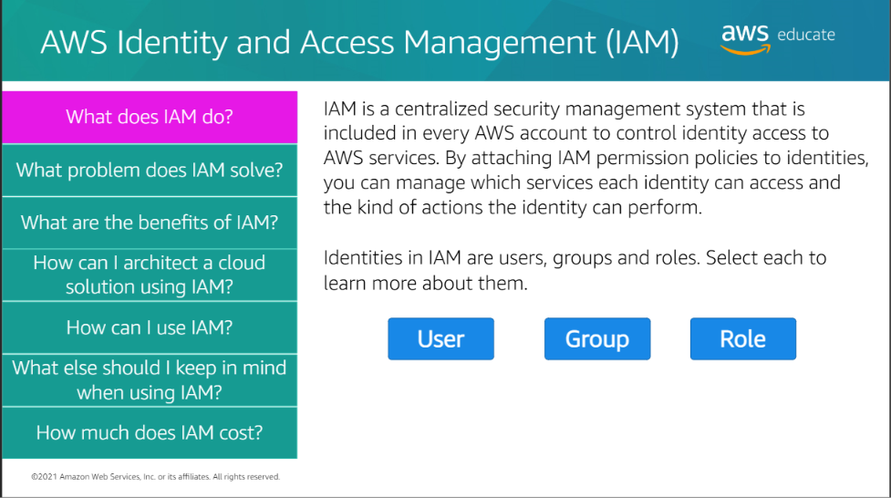
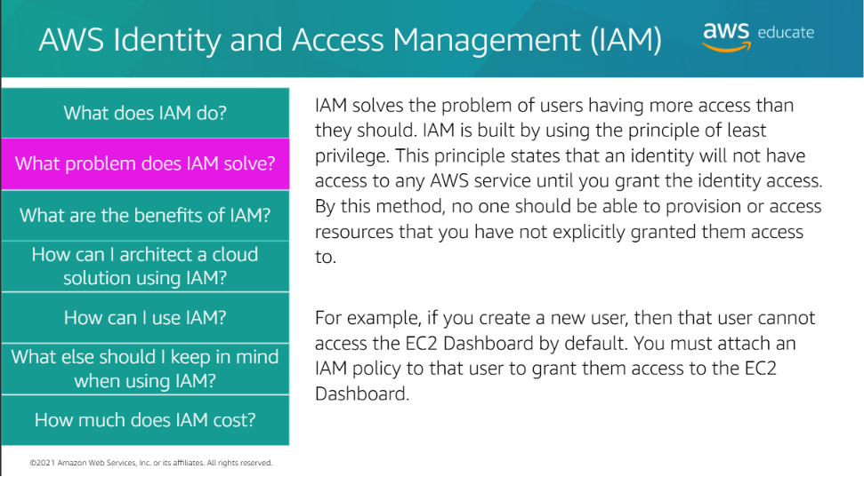
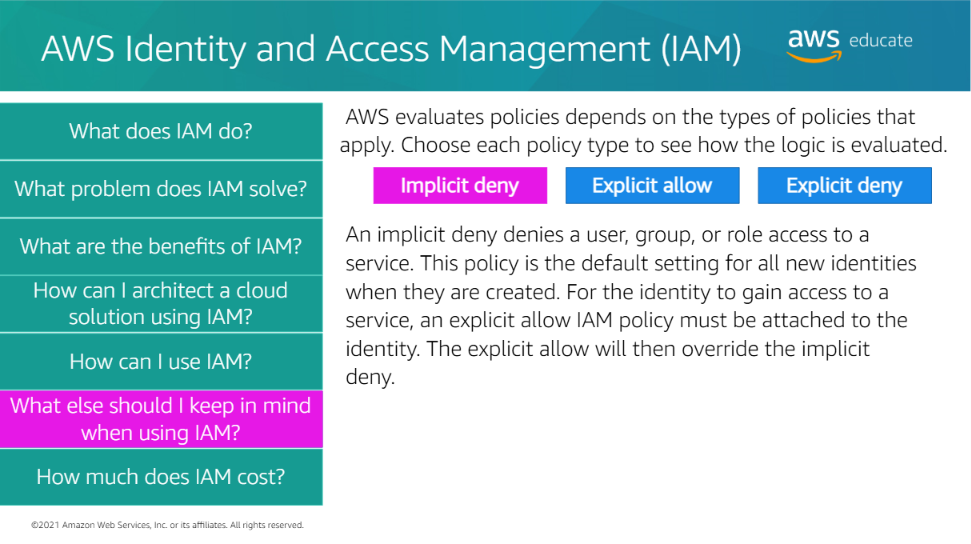
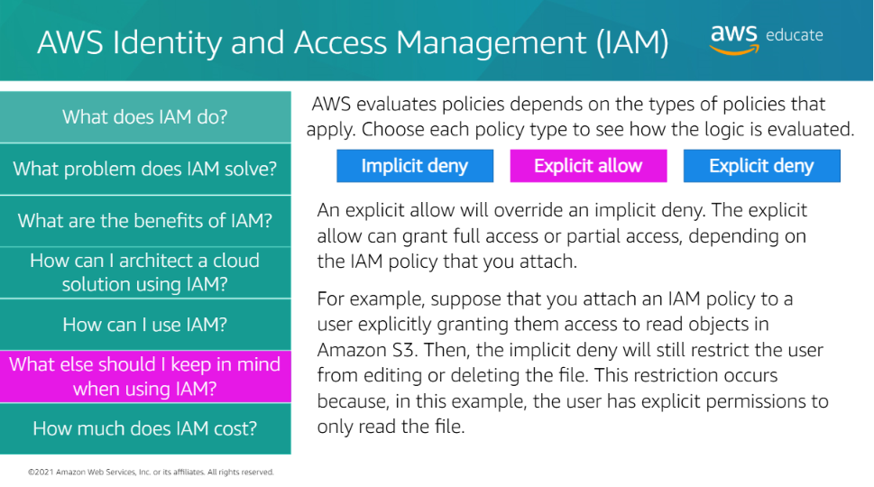
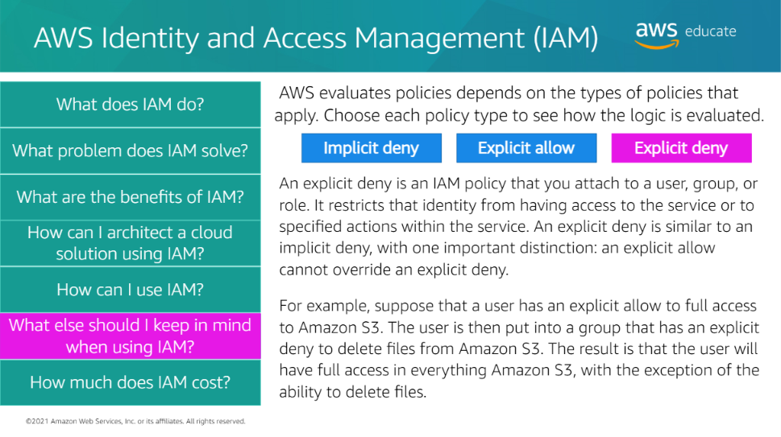
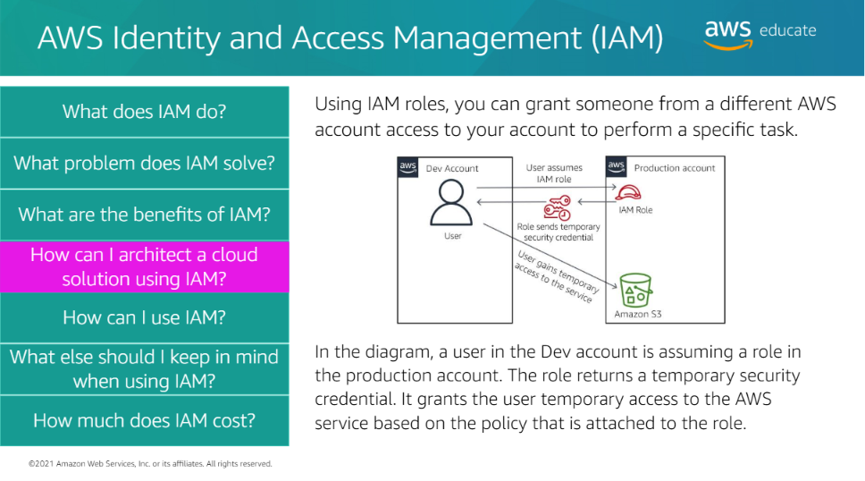

## AWS Identity and Access Management (IAM)

AWS Identity and Access Management (IAM) is a security service that controls **who can access AWS resources** and **what actions they are allowed to perform**.

<h3>Why Do We Need IAM?</h3>

In an organization, multiple people use the same AWS account.

Without IAM:

- Anyone could access all AWS resources.
- Sensitive data could be modified or deleted.
- There would be no access control.

IAM solves this by providing **authentication** and **authorization**.

<h2>What is IAM?</h2>

> **Definition:** AWS Identity and Access Management (IAM) is a centralized security service used to manage identities and permissions for AWS resources.

Simply:

> **IAM = Controls "Who can access AWS?" and "What can they do?"**

<h3>IAM Components</h3>

IAM mainly consists of:

- 👤 User
- 👥 Group
- 🎭 Role
- 📜 Policy

We'll learn each of these in detail later.

<h3>How IAM Works</h3>

```text
User
   │
Login
   │
IAM Authentication
   │
Checks Permissions
   │
   ├── Allowed ✅
   └── Denied ❌
```












<h3>Benefits of IAM</h3>

- Secure access to AWS resources
- Fine-grained permissions
- Centralized access management
- Supports Multi-Factor Authentication (MFA)
- Follows the Principle of Least Privilege

<h3>Common IAM Use Cases</h3>

- Create users for team members
- Assign permissions using policies
- Organize users into groups
- Grant temporary access using roles
