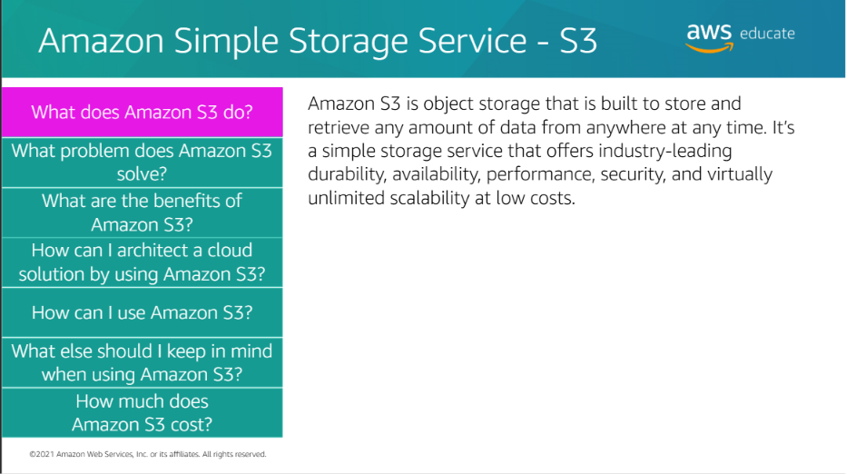
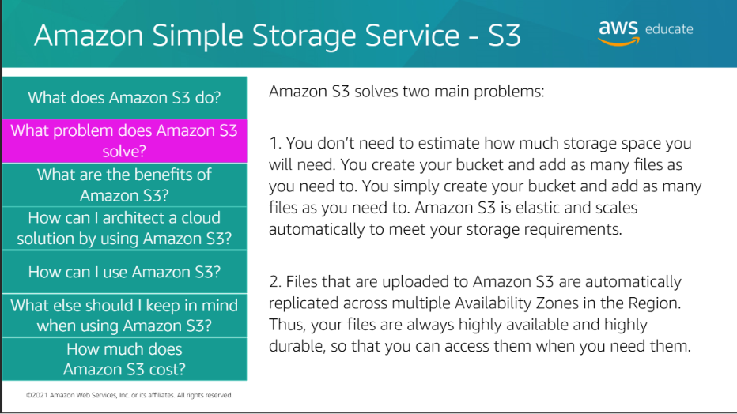

## Amazon Simple Storage Service (Amazon S3)

Amazon S3 (Simple Storage Service) is AWS's **Object Storage** service used to store and retrieve data from anywhere over the internet.

<h2>Why Do We Need S3?</h2>

Applications need storage for:

- Images
- Videos
- Documents
- Backups
- Static Website Files
- Log Files

Instead of storing these files on a server, we store them in **Amazon S3**.

<h2>What is Amazon S3?</h2>

> **Definition:** Amazon S3 is a highly durable, scalable, and secure object storage service provided by AWS.

Simply:

> **S3 = Store and retrieve files in the cloud.**

<h3>How S3 Works</h3>

```text
User
 │
 ▼
Upload File
 │
 ▼
Amazon S3 Bucket
 │
 ▼
Store Object
```

Files stored in S3 are called **Objects**.

<h2>Important Terms</h2>

### Bucket

> A **Bucket** is a container used to store objects in Amazon S3.

Example:

```text
Bucket
│
├── image1.png
├── resume.pdf
├── video.mp4
└── notes.docx
```

### Object

> An **Object** is a file stored inside an S3 Bucket.

Each object contains:

- Data
- Metadata
- Unique Key

### Object Key

> A **Key** is the unique name (path) of an object inside a bucket.

Example:

```text
Bucket
│
└── images/profile.png
```

Here,

`images/profile.png` is the **Object Key**.






<h3>Common Use Cases</h3>

Amazon S3 is commonly used for:

- Image Storage
- Video Storage
- File Uploads
- Application Backups
- Static Website Hosting
- Log Storage

<h3>Features of Amazon S3</h3>

- Highly Durable
- Highly Available
- Scalable
- Secure
- Pay-as-you-go
- Accessible from anywhere

**Q. Is Amazon S3 a serverless service?**

> Yes. AWS manages the infrastructure, and users only store and access their data.

<h2>Key Takeaways</h2>

- S3 is an **Object Storage** service.
- Files are stored as **Objects**.
- Objects are stored inside **Buckets**.
- Every object has a unique **Key**.
- S3 is highly durable, scalable, secure, and serverless.

## S3 Bucket Policy

## What is a Bucket Policy?

> **S3 Bucket Policy is a JSON-based resource policy attached directly to an S3 bucket.**

It defines:

- **Who** can access the bucket
- **What actions** they can perform
- **Which resources** they can access

Think of it like a **security guard for your S3 bucket**.

## Why Do We Need a Bucket Policy?

Bucket policies are used to control access to objects stored inside an S3 bucket.

For example:

```text
Anyone
  ↓
Can READ
  ↓
Objects in this bucket
```

But they cannot:

```text
 Upload
 Delete
 Modify
```

## Bucket Policy Structure

A bucket policy is written in **JSON**.

```json
{
  "Version": "2012-10-17",
  "Statement": [
    {
      "Effect": "Allow",
      "Principal": "*",
      "Action": "s3:GetObject",
      "Resource": "arn:aws:s3:::my-bucket/*"
    }
  ]
}
```

<h3>Important Elements</h3>

### `Effect`

Defines whether access is allowed or denied.

```json
"Effect": "Allow"
```

Possible values:

- `Allow`
- `Deny`

### `Principal`

Defines **WHO** receives the permission.

```json
"Principal": "*"
```

`*` means:

> Everyone

You can also specify a particular AWS principal.

### `Action`

Defines **WHAT** the principal can do.

Common S3 actions:

| Action | Meaning |
|--------|---------|
| `s3:GetObject` | Read/download an object |
| `s3:PutObject` | Upload an object |
| `s3:DeleteObject` | Delete an object |
| `s3:ListBucket` | List objects in a bucket |

Example:

```json
"Action": "s3:GetObject"
```

means:

> Allow reading/downloading objects.

### `Resource`

Defines **WHICH AWS resource** the policy applies to.

```json
"Resource": "arn:aws:s3:::my-bucket/*"
```

Here:

```text
arn:aws:s3:::my-bucket
                ↓
             Bucket

/*
 ↓
Objects inside bucket
```

Therefore:

```text
arn:aws:s3:::my-bucket/*
```

means:

> All objects inside `my-bucket`.

## Bucket Policy vs Block Public Access

These are two different concepts.

### Bucket Policy

> Defines what access is allowed or denied.

```text
Bucket Policy
      ↓
"Who can do what?"
```

### Block Public Access

> Prevents public access when the relevant S3 public-access-block settings are enabled.

```text
Block Public Access
        ↓
"Should public access be blocked?"
```

### Example

Suppose:

```text
Bucket Policy
      ↓
Allow Everyone
      ↓
s3:GetObject
```

But:

```text
Block Public Access = ON
```

Public access can still be blocked.

```text
Internet User
      ↓
Bucket Policy
      ↓
Allow Read
      ↓
Block Public Access
      ↓
     🚫
```

If public access is intentionally required, the relevant Block Public Access settings must permit it.

## Bucket Policy vs IAM Policy

| IAM Policy | Bucket Policy |
|------------|---------------|
| Attached to IAM users, groups, or roles | Attached directly to an S3 bucket |
| Identity-based policy | Resource-based policy |
| Controls what an identity can do | Controls who can access a bucket/resource |
| Example: User can read S3 objects | Example: Bucket allows public read |

Think:

```text
IAM Policy
    ↓
"What can THIS AWS user/role do?"

Bucket Policy
    ↓
"Who can access THIS bucket and what can they do?"
```

## Public S3 Bucket

If you want anyone on the internet to read objects:

```json
{
  "Version": "2012-10-17",
  "Statement": [
    {
      "Sid": "PublicReadGetObject",
      "Effect": "Allow",
      "Principal": "*",
      "Action": "s3:GetObject",
      "Resource": "arn:aws:s3:::my-bucket/*"
    }
  ]
}
```

This allows anonymous users to perform:

```text
Public User
    ↓
s3:GetObject
    ↓
S3 Object
```

It does **not** give them permission to upload or delete objects.

## Sharing with Another AWS Account

A bucket can also grant access to a specific AWS principal instead of making the bucket public.

Example:

```json
{
  "Version": "2012-10-17",
  "Statement": [
    {
      "Sid": "AllowAccountToRead",
      "Effect": "Allow",
      "Principal": {
        "AWS": "arn:aws:iam::ACCOUNT_ID_HERE:root"
      },
      "Action": "s3:GetObject",
      "Resource": "arn:aws:s3:::my-bucket/*"
    }
  ]
}
```

This is different from:

```json
"Principal": "*"
```

because `*` means **anyone**, while the specific principal limits access to the specified AWS account/principal.

## Security Warning ⚠️

Making an S3 bucket or its objects public means they can potentially be accessed by people on the internet.

Do **not** make production data public unless there is a genuine requirement.

Safer approaches can include:

- IAM permissions
- Private S3 buckets
- CloudFront
- Presigned URLs

For learning, you can experiment with a **test bucket and test files**, but understand exactly which resources you are making public.

## Memory Trick 🧠

```text
Bucket Policy
      ↓
"What access is allowed?"

Block Public Access
      ↓
"Should public access be blocked?"

IAM Policy
      ↓
"What can this AWS user/role do?"
```

## Key Takeaways

- **Bucket Policy = Resource-based JSON policy attached to an S3 bucket.**
- `Principal` → **WHO**
- `Action` → **WHAT**
- `Resource` → **WHICH resource**
- `Effect` → **Allow or Deny**
- `s3:GetObject` → Read/download objects.
- `s3:PutObject` → Upload objects.
- `s3:DeleteObject` → Delete objects.
- `Principal: "*"` can make access available to anyone, if public-access-block settings permit it.
- **Block Public Access** can prevent public access.
- Avoid making production S3 data public unless required.
