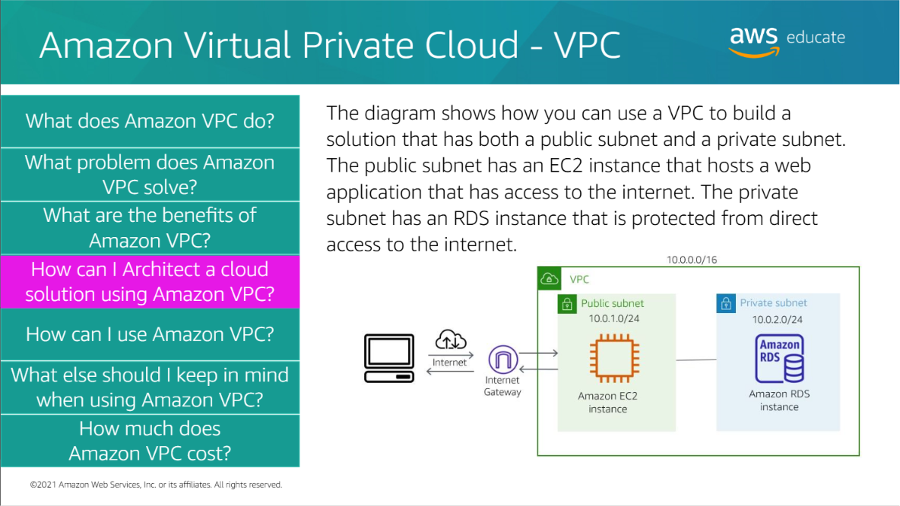
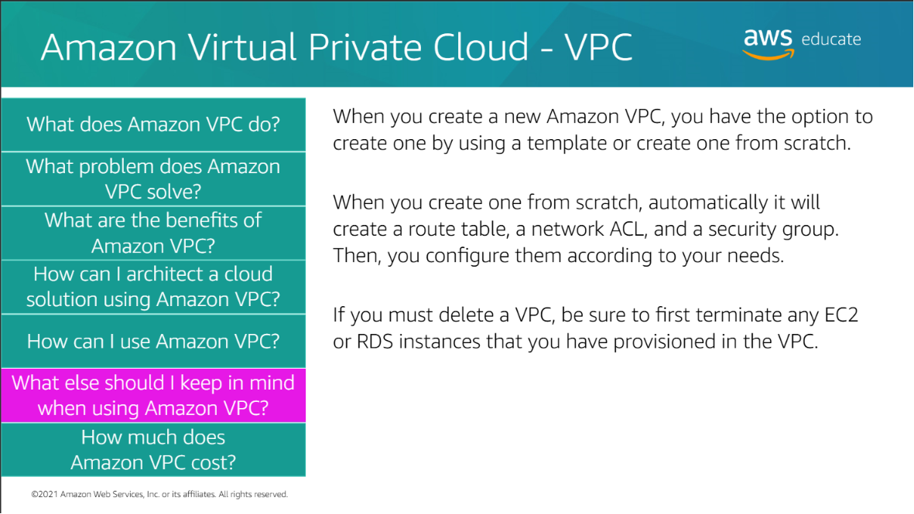

## Amazon Virtual Private Cloud (Amazon VPC)

Amazon VPC (Virtual Private Cloud) is a service that allows you to create a **private and isolated virtual network** within AWS to securely launch and manage AWS resources.

<h3>Why Do We Need VPC?</h3>

When deploying applications in AWS, we need:

- Network Isolation
- Secure Communication 
- Controlled Access
- Protection from Unauthorized Users

VPC provides a secure environment for AWS resources.

<h2>What is Amazon VPC?</h2>

> **Definition:** Amazon VPC is a service that enables you to create a logically isolated virtual network in the AWS Cloud.

Simply:

> **VPC = Your own private network inside AWS.**

<h3>How VPC Works</h3>

```text
                  Amazon VPC
         ┌─────────────────────────┐
         │                         │
         │   Public Subnet         │
Internet │      EC2                │
────────►│                         │
         │   Private Subnet        │
         │      RDS                │
         │                         │
         └─────────────────────────┘
```

<h2>Key Components</h2>

### VPC

A private virtual network that contains AWS resources.

### Public Subnet

> A subnet that allows resources to communicate with the internet.

Common Resources:

- EC2 Web Server
- Load Balancer
- NAT Gateway

### Private Subnet

> A subnet that does **not** allow direct internet access.

Common Resources:

- Amazon RDS
- Internal Servers
- Databases

### Internet Gateway (IGW)

> Allows communication between a VPC and the Internet.

### Route Table

> Defines how network traffic is routed within the VPC.

### Security Group

> Acts as a **virtual firewall** for AWS resources.

Controls:

- Inbound Traffic
- Outbound Traffic

<h3>Common Use Cases</h3>

- Secure Web Applications
- Multi-tier Architectures
- Hosting Databases
- Enterprise Networks
- Private APIs

<h3>Benefits of Amazon VPC</h3>

- Network Isolation
- Enhanced Security
- Flexible Networking
- High Availability
- Secure Resource Communication





<h2>Key Takeaways</h2>

- Amazon VPC provides a **private network** inside AWS.
- A VPC contains one or more **Subnets**.
- **Public Subnets** are used for internet-facing resources.
- **Private Subnets** are used for secure internal resources.
- **Internet Gateway** enables internet connectivity.
- **Route Tables** control network traffic.
- **Security Groups** protect AWS resources by acting as virtual firewalls.
