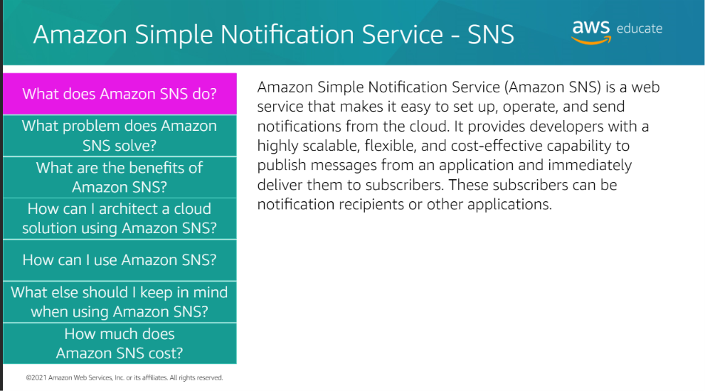
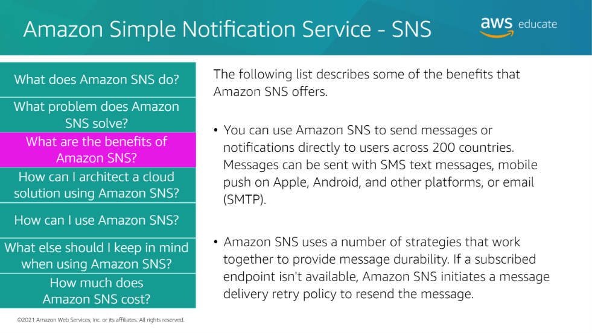
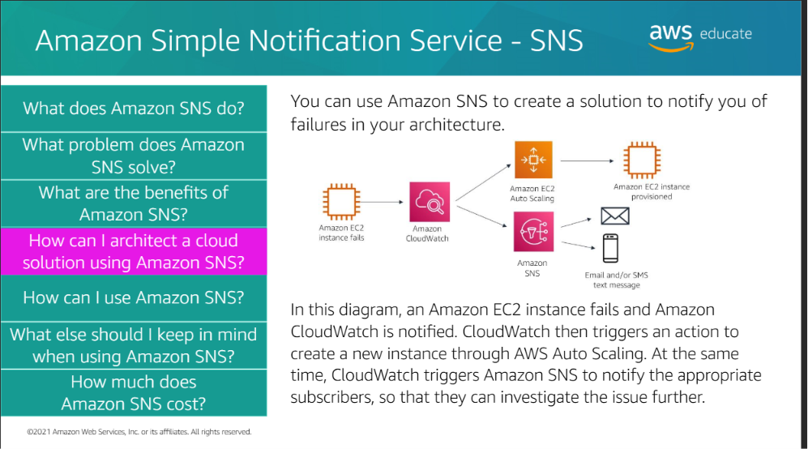
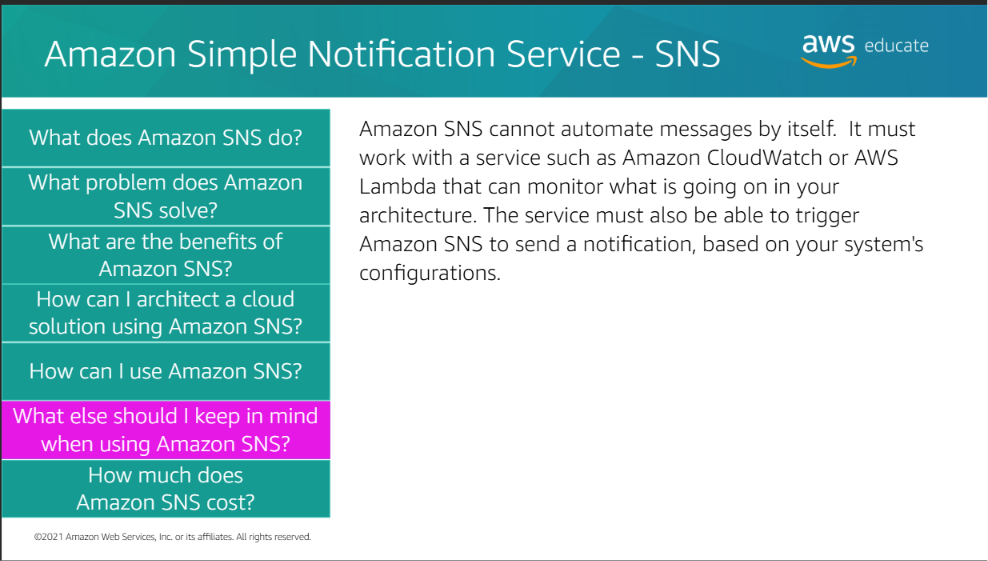
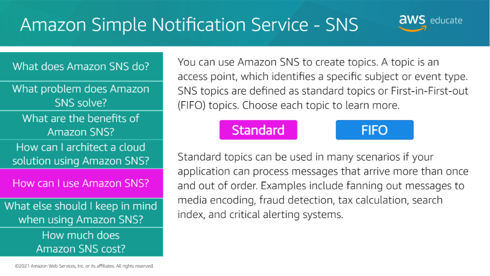
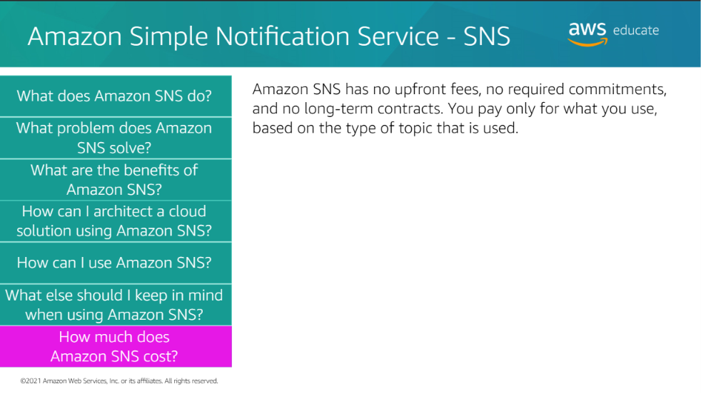

<h3>SNS Standard vs FIFO</h3>

| Feature | Standard SNS | FIFO SNS |
|---------|--------------|----------|
| Ordering | Best effort | Ordered |
| Throughput | Very high | Lower than Standard |
| Duplicate Handling | Possible | Built-in deduplication |
| Use Case | Notifications | Ordered events |
| Example | Email / CloudWatch alerts | Financial / Order processing |

<h3>Easy Memory Trick</h3>

> **Standard = Speed + Scale**

> **FIFO = Order + Deduplication**
